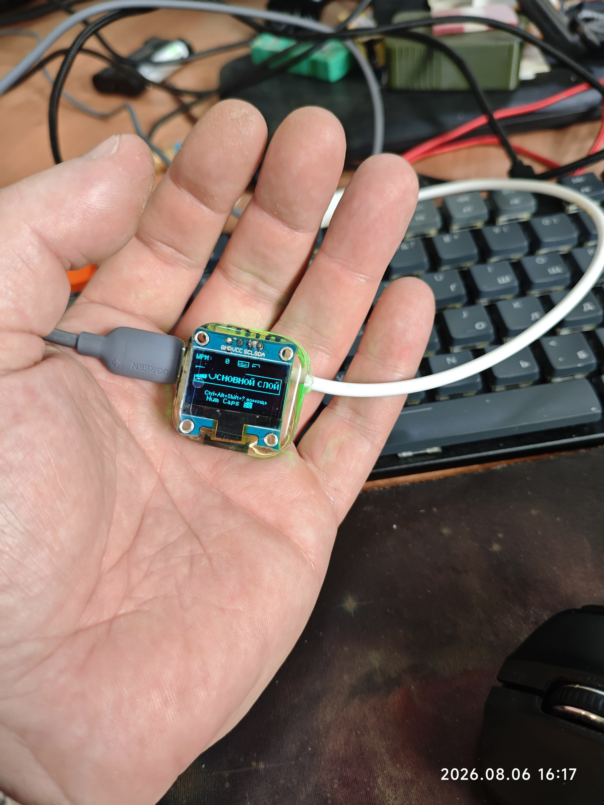
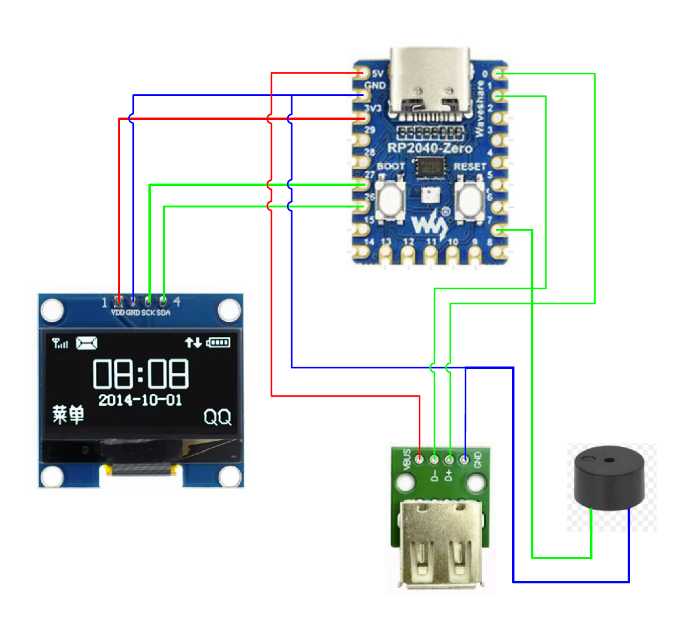

# rp2040
QMK USB Converter based on RP2040

# Appearance

  

# Assembly

  

# Build
1. git clone https://github.com/qmk/qmk_firmware.git
2. cd qmk_firmware
3. git checkout --force 0.22.0
4. qmk doctor
5. cp keyboards/rp2040/mini/lib/ws2812_vendor.c platforms/chibios/drivers/vendor/RP/RP2040/ws2812_vendor.c
6. cd keyboards
7. git clone *This project*
8. qmk compile -kb rp2040/mini -km default

# Flash
Hold BOOTSEL: Press and hold the physical BOOTSEL button on the board.
Plug in: Insert the USB cable into your computer while holding the button.
Release: Let go of the button once a new USB drive named RPI-RP2 appears.
Transfer: Drag and drop your .uf2 file directly onto the drive. 
The board will reboot automatically.
